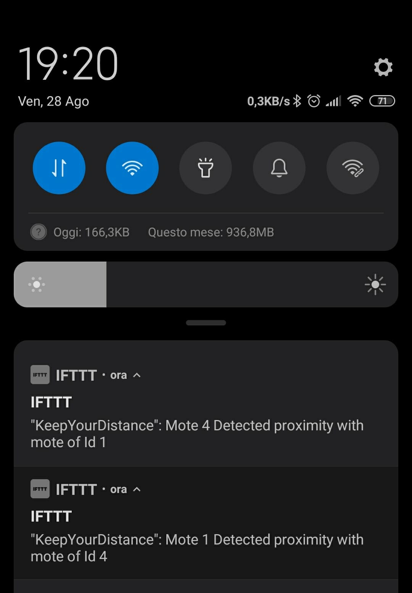

# KeepYourDistance

A proximity alarm implementation in nc for tinyOS and node-red
Project for the IoT Msc course of 2k20

By Gianmarco Poggi - id: 10545590

## Problem Approach

Since the IoT devices are supposed to be low power computers i preferred, where possible to keep the mote computation to it's minimum, offsetting eventual workloads to higher levels, such as node-red.

Therefore the source code of the motes firmware is responsible only for the basic things, such as:

- A 2Hz timer started on boot to fire the sending of the broadcast of it's TOS_NODE_ID via radio
- Upon the reception of a message from another mote, the recepient mote stores in a variable the Id of the sender, contained in the broadcast message, and communicates it on the serial port, via a printf, that is intercepted by node-red
- Upon reflecting on the realization of the above specification i believed that the mote shouldn't be responsible for keeping a log of the encounters, which can be performed by node-red or other higher layers after reading the mote output on the serial socket, so the mote only has a variable to store the id of the last encountered mote.
	
# Realization

The repository includes a cooja simulation ready to go of 5 motes that boot in an elliptic configuration, all well distanced, each of them is attached a serial socket as a server, to output the printfs, both for debug that for actual output to node-red.

The node-red flow has a tcp listener attached to each of the ports that is responsible to capture any printf the mote emits, after which it uses a split to route to a sink the debug messages and the actual printf to a parser.

The parser is responsible for cleaning the mote output from the bloat that distortes the messages in node red and craft individual packets to be used in the IFTTT webhook.
Before the actual send of the request a 1s rate limiter has been used, since the high frequency of the mote timers could have flooded the API resulting in some request getting lost.

The webhook on the IFTTT is configured to send a notification with the details of the mote encounter extracted from the request generated by node-red. The notification is purposely crafted to contain both the mote that registered the encounter and the id of the encountered mote.

# Conclusion

Upon different and repeated configurations tested we can affirm that the mote detects correctly every  encounter and correctly communicates them with node-red, resulting in a notification on my phone.

Below some images to illustrate it.

